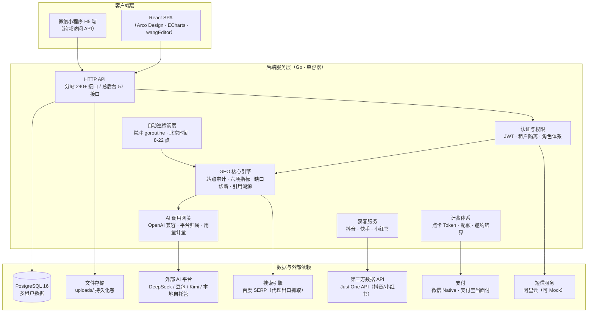

# LinkGeo 技术架构与功能详情

> 版本：v1.0.63 ｜ 更新日期：2026-09-14 ｜ 本文档基于系统实际代码与线上运行配置整理

---

## 1. 产品概述

**LinkGeo** 是一套面向企业的 **GEO（生成式引擎优化）智能运营平台**：帮助品牌与机构系统化提升在 **百度搜索 + AI 大模型（DeepSeek、豆包、Kimi 等）** 场景下的品牌曝光、内容占位与获客转化，并配套 **抖音 / 快手 / 小红书短视频获客** 与 **AI 智能创作** 能力。

产品以 SaaS 多租户形态运营：**一个总后台（SaaS 运营端）+ N 个分站（客户工作台）+ 渠道商体系**，通过卡密授权与点卡（Token）计费实现商业闭环。

### 1.1 三大能力支柱

| 支柱 | 说明 |
|---|---|
| **GEO 智能中心** | 品牌事实库、竞品监控、风险词治理、六项指标度量、缺口诊断、AI 引用溯源、巡检任务全自动化 |
| **百度优化** | 关键词分析、排名监控、收录查询、站点体检、差距诊断、行业排行 |
| **获客增长** | 抖音/快手/小红书短视频获客（同行追踪 + AI 话术）、智能创作中心、成功案例库 |

---

## 2. 总体架构

### 2.1 分层说明

| 层 | 技术选型 | 说明 |
|---|---|---|
| 前端 | React 18 + TypeScript + Arco Design 2.63 + ECharts 5.5 + wangEditor + DOMPurify + Vite 5 | 构建产物 `go:embed` 内嵌进后端二进制，**单进程交付**，无独立前端服务器 |
| 后端 | Go + Gin 1.10 + GORM 1.31 | 全部业务一个服务，HTTP 接口 + 常驻后台任务 |
| 数据库 | PostgreSQL 16（生产）/ SQLite（单机版） | 全表按 `tenant_id` 隔离，高频表复合索引 `(tenant_id, created_at DESC)` |
| 认证 | JWT（自定义密钥）+ 滑块验证码 + 短信/邮箱验证 | 密码 AES-256-GCM 可逆加密（后台可查看明文，密钥由 `GEO_SECRET_KEY` 派生） |
| 部署 | Docker Compose：`geotool` 应用容器 + `geotool-postgres` 数据库容器 | 数据库仅映射本机回环端口；`uploads/` 挂载宿主机持久化 |

---

## 3. 多租户与权限模型

### 3.1 租户模型

- **一个客户 = 一个分站（tenant）+ 一个管理员账号（admin）**，注册即自动开通试用。
- 全表数据按 `tenant_id` 硬隔离；总后台（`tenant_id=0`）可跨租户管理与模拟登录分站。
- **AI 平台归属规则**：分站只用自己配置的 AI 平台（客户自备 Key、自付 API 费），**不继承总后台全局平台**——防止跨账号扣费。

### 3.2 角色体系

| 角色 | 权限范围 |
|---|---|
| `super` | 总后台管理员：客户/渠道/平台/内容/计费全局管理 |
| `channel` | 渠道商：管理自己渠道下的分站 + 品牌/客服设置 |
| `admin` | 分站管理员：分站全功能 + 账号管理 |
| `operator` | AI 优化员（受限）：只读 + 部分操作，不可改密码 |

### 3.3 权限控制

- 前端菜单按 `features` 标签过滤（功能级权限，分站套餐可裁剪模块）。
- 后端接口统一租户中间件 + 角色中间件（`AdminOnly` 等）；未登录 401、越权 403。
- 登录日志全量记录（成功/失败、IP、来源），连续失败触发登录守护。

---

## 4. 核心子系统

### 4.1 自动巡检引擎

- **全自动**：后端常驻 goroutine，每 `GEO_CRON_MINUTES`（默认 60）分钟一轮，仅在**北京时间 8:00–22:00** 执行，与浏览器是否关闭无关。
- 巡检内容：AI 平台问答品牌事实核查、竞品占位、风险词、引用溯源、六项 GEO 指标计算，结果写入 `check_results` 并供「智能中心/工作日志」展示。
- 可靠性设计（历次事故沉淀）：
  - 失败自动退款（先扣费后调用，失败/空结果退点卡）；
  - 确定性故障熔断（账户欠费/Key 失效连续 5 次即跳过，成功清零）；
  - 超时保护真正可中断（占号/取锁全走 `ctx.Done()` 取消通道）。

### 4.2 AI 调用网关

- 统一 `ai.Client` 唯一入口（OpenAI 兼容），平台选择走 `ai_platform` 服务（唯一权威来源）。
- 请求级用量计量（`ai_usage_records`：输入/输出 token、场景、平台、模型），驱动「Token 用量」看板。
- AI 助手数据面与 `users/tenants/密钥` 隔离，已通过 12 组真机提示词注入攻击审计（详见安全章节）。

### 4.3 计费体系

| 机制 | 说明 |
|---|---|
| **点卡 Token** | 按次扣费（AI 调用 1 次 = 1 token）；流水可追溯（`point_records`：动作、金额、操作后余额） |
| **每日查询配额** | 百度模块租户可配（默认 3 次/天）；短视频查询独立池 **固定 10 次/天**，超限提示联系官方解锁 |
| **邀约奖励** | 邀请 1 人注册 = 本人 +2000 token + 服务延 1 个月（上不封顶）；被邀请人注册成功自动 +2000 token；手机号唯一防刷 |
| **成长计划** | 每日签到，连续奖励递增（5 点起、封顶 50 点），成长等级（青铜→铂金） |
| **充值** | 扫码充值（微信 Native / 支付宝当面付，订单轮询自动到账）+ 卡密兑换 |
| **卡密授权** | 密钥对体系（10000 张：3 天试用 ×7000 / 12 个月 ×3000），首次激活生效，防重放 |
| **续费** | 服务到期时间顺延 + OpenMonths 累计，右上角显示剩余天数倒计时（临期橙色提醒） |

### 4.4 合规设计（短视频获客）

抖音/快手/小红书三平台统一**半自动合规模式**：

- 不模拟登录任何平台账号、不自动群发；
- 同步抓取仅面向公开数据且尽力而为，失败降级为**结构化估算**（`sourced_from=real/estimate` 严格标记，严禁把估算冒充真实数据）；
- 打招呼 = 「AI 生成话术 → 前置校验 → 复制话术 → 人工官方客户端发送 → 标记」，系统**绝不代发**；
- 频率与安全：每账号每日上限、最小间隔、活跃时段、达上限冷却、同日重复忽略（五重服务端校验）。

---

## 5. 功能详情

### 5.1 GEO 智能中心（分站核心工作台）

| 模块 | 功能点 |
|---|---|
| **智能中心**（首屏） | 品牌事实库（AI 应如何回答你的品牌）、竞品监控、风险词治理、**六项 GEO 指标**（可见性/引用/情感/准确性/一致性/权威度）、缺口诊断、行动计划、AI 引用溯源、站点审计报告 |
| **关键词监控** | 关键词配置、排名快照自动落库、批量分析 |
| **AI 平台** | 平台配置（DeepSeek/豆包/Kimi/OpenAI 兼容/本地自托管）、模型选择、连通性测试、优先级选择 |
| **巡检任务** | 定时任务管理、执行记录、熔断状态、失败退款明细 |
| **内容投放** | 内容素材管理、投放任务、媒体渠道 |
| **生成报告** | 一键生成 GEO 诊断报告（可导出） |
| **工作日志** | 聚合 6 类事件源（巡检/优化/创作/审计/聚类/引用）为统一时间线，让客户看见系统在后台干什么 |

### 5.2 百度优化

| 模块 | 功能点 |
|---|---|
| **关键词分析** | 关键词/网站配置、SERP 抓取（代理出口防风控）、广告位剔除、霸屏统计 |
| **排名监控** | 全部监控词排名聚合、升降趋势（上升/下降/持平/新上榜）、宽屏表格 + 窄屏卡片流自适应 |
| **收录查询** | `site:` 收录量查询（消耗 1 次配额） |
| **站点体检** | 站点审计（SEO 健康分、问题清单） |
| **差距诊断** | 与竞品差距分析 |
| **行业排行** | 百度指数行业排行（品牌指数/搜索/资讯/互动，日/周维度） |

### 5.3 短视频获客（抖音 / 快手 / 小红书）

三平台同一套结构（每个平台独立数据与配置）：

1. **账号管理**：多账号、每日上限、冷却/恢复自动计算
2. **同行追踪**：粘贴主页链接批量导入、自动生成同行画像（粉丝/作品数）
3. **视频/笔记分析**：爆款聚合（播放/点赞/评论/互动率）、Top 榜单
4. **获客线索**：评论客户管理、状态机（待跟进→已打招呼→已回复）、价值标记
5. **AI 话术**：一键生成真人化开场话术（计费），话术库
6. **频率与安全**：五重校验配置
7. **动作日志**：全部操作时间线可追溯

### 5.4 智能创作中心

- AI 内容创作（角色设定、会话、素材库、创作记录）
- 创作能力独立 feature 权限，可随套餐裁剪

### 5.5 充值中心（双页签）

| 页签 | 内容 |
|---|---|
| **充值兑换** | Token 余额、扫码充值（选渠道→选套餐→下单→二维码→轮询到账）、卡密兑换、**邀约奖励卡**（邀请码/已邀请人数/累计奖励/复制邀请链接）、Token 流水 |
| **Token 用量** | 总消耗/调用次数/输入/输出 KPI、每日趋势（柱+折线）、平台用量分布（饼图）、场景分布、最近调用记录 |

### 5.6 内容与增长

| 模块 | 说明 |
|---|---|
| **成功案例** | SaaS 端上传（富文本图文 + 封面 + 标签 + 发布/草稿），客户端卡片流 + 详情展示 |
| **使用指南** | SaaS 端编辑的帮助文档（图文 + B 站视频嵌入），分站侧栏下拉直达 |
| **消息中心** | 站内信（列表/未读角标/已读）、SaaS 端可推送到全部/指定分站/指定用户 |
| **仪表盘** | 分站工作台首页（GEO 状态概览、配置引导） |

### 5.7 SaaS 总后台

| 模块 | 说明 |
|---|---|
| 总览 | 平台经营数据总览 |
| 客户管理 | 分站管理 + 账号管理（融合入口）、模拟登录、续费/延期、套餐与功能裁剪、邀约奖励配置 |
| 渠道管理 | 渠道商管理、渠道自建分站、品牌/客服设置 |
| AI 平台 | 全局平台配置（tenant_id=0） |
| 站内信推送 | 全量/分站/用户定向推送 |
| 卡密管理 | 密钥对、批量生成/导出卡密 |
| 短信设置 | 注册验证开关（短信/邮箱/关闭）、阿里云配置 |
| 数据 API | 抖音/小红书稳定抓取 token 配置 |
| 帮助文档 / 成功案例 | 内容运营编辑 |
| 套餐设置 | 充值套餐（价格/点数/配额解锁） |
| 系统设置 | 品牌名称/Logo/版权、账号安全、登录日志、扫码支付配置、注册协议 |

---

## 6. 数据与安全

### 6.1 数据模型

- 17 个模型文件、60+ 张表：租户、用户、AI 平台、巡检任务/结果、引用溯源、百度关键词/排名快照、抖音/快手/小红书获客（每平台 6 表）、创作中心、点卡流水、充值订单、卡密、邀请记录、签到、站内信、帮助文档、成功案例、登录日志等。
- 关键索引规则：所有高频列表表带 `(tenant_id, created_at DESC)` 复合索引（实测查询快 30 倍）。

### 6.2 安全设计

| 维度 | 措施 |
|---|---|
| 认证 | 滑块验证码（轨迹校验）+ 短信/邮箱验证码 + JWT |
| 密码 | AES-256-GCM 可逆加密（密钥派生自 `GEO_SECRET_KEY`） |
| 登录防护 | 登录日志、连续失败守护、IP 限流 |
| AI 安全 | 助手上下文仅含 GEO 诊断字段，数据面够不到账号/密钥类数据；12 组真机提示词注入攻击全部抵御（2026-09-12 审计报告） |
| 富文本 XSS | 所有富文本渲染经 DOMPurify 清洗 |
| 文件上传 | 扩展名白名单 + 文件魔数嗅探 + 随机文件名（防穿越/伪装） |
| 数据隔离 | 全表 `tenant_id` 隔离；接口层 401/403 硬校验；super 模拟登录仅限总后台 token |

### 6.3 运维要点

- **备份**：数据库备份脚本（更新/部署前必须执行），备份至 `backups/pg/`。
- **密钥管理**：`GEO_JWT_SECRET`/`GEO_SECRET_KEY` 固化在 docker-compose；更换 `GEO_SECRET_KEY` 前必须先重加密存量 `enc:v1` 数据。
- **时区铁律**：容器 UTC，业务「按天」逻辑一律走北京时间 `services/biztime`。
- **百度风控**：SERP 抓取走宿主机转发代理出口（`GEO_BAIDU_PROXY`），容器出口 IP 不进百度黑名单。

---

## 7. 接口规模统计

| 范围 | 数量 |
|---|---|
| 分站 API（tenant 工作台） | 240+ |
| 总后台 API（super） | 57 |
| 前端页面 | 30 |
| 后端服务包 | 21 |

---

## 8. 附录：关键服务包索引

| 包 | 职责 |
|---|---|
| `services/geo` | GEO 指标计算、站点审计核心 |
| `services/ai` | 统一 AI 客户端（OpenAI 兼容） |
| `services/ai_platform` | AI 平台归属与可用性判定（唯一权威） |
| `services/baidu` | 百度抓取与 SERP 解析（唯一入口） |
| `services/douyin` / `ks` / `xhs` | 三平台获客服务（设置/估算/AI 话术） |
| `services/points` / `recharge` / `card` | 点卡计费 / 扫码充值 / 卡密授权 |
| `services/biztime` | 业务时区（北京时间） |
| `services/pay` / `sms` / `notify` | 支付 / 短信 / 通知 |
| `services/captcha` / `crypto` / `identicon` | 验证码 / 加密 / 头像 |
